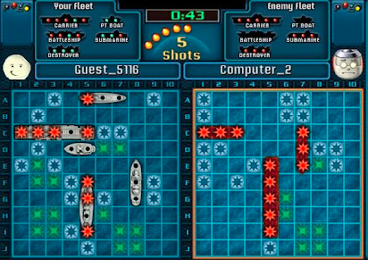

### Problem Statement: Battleship Game

Write code for design of Battleship Game: https://en.wikipedia.org/wiki/Battleship_(game)

#### Rules of the Game
1. There are 2 players in the game.
1. Each Person has two boards, one where he places his own ships, one where he tracks
   the missiles he has fired. Each board is of size 10x10.
1. Each person can place 5 ships on his board 
   1. Carrier of length 5
   1. Battleship of length 4
   1. Cruiser of length 3
   1. Submarine of length 3
   1. Destroyer of length 2
1. Players take a turn to fire missiles at the opposing player. If the missile hits a ship, then
   the opposing player informs the initial mover of a hit, else he says it’s a miss. If all the
   spots on a ship are hit, then ship is sunk.
1. The first player to sink all 5 ships of the opposing player wins the game.

This is the view of one player
1. Left-hand side is the ships as placed by the player. Red spots represent where the
   enemy successfully struck the player’s ships.
2. White/Green spots are where the enemy player missed.
3. The right-hand side is where the player has launched missiles against the enemy.
4. The player has sunk 3 of the enemy ship.

   
######  Bonus Requirement:
You don’t need to code this up, but explain how will you extend your design to
   allow people to play over the network (p2p without having a central server).

#### Guidelines
1. We will be looking for the Low-Level Design including good class structure, entities and
   how they interact, good abstraction, good separation of concerns, etc
2. You will need to code the “Game Loop”.
3. You don’t need to bother with the code that “draws” the game or UI interactions, you can
   mock the function for eg. “drawBoard(List<Ship> ships)” and assume it draws the board
   with the ships on it. You can also assume a “takeInput(Player player)” function that gets
   the play that the current player wishes to make.  
   1. Bonus: Take the input from the console. For eg. player can say “Fire C5” and you
   fire a missile at C5 or “Draw Board” and you print the current state of the board to
   the player.
4. You can choose any language, however, it needs to be a runnable code.
   
#### Assumptions
   Please make the required assumptions, for instance, players can only join before the
   game starts, but MAKE SURE YOU LIST THEM IN A README FILE along with the code.
